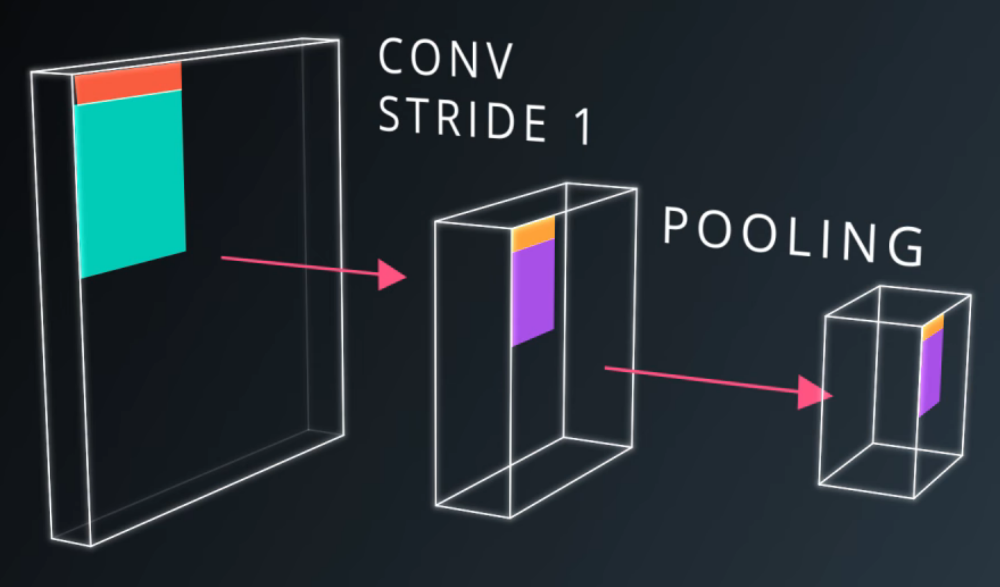

```{r setup, include=FALSE}
knitr::opts_chunk$set(echo = TRUE)
```

# Agenda


## We'll Cover

* Deep Learning
* Neural Networks
* Tensorflow
* Different Types of Neural Nets


# Deep Learning

## Lots of data, complex problems


## Solving things only humans could do


## Common language and toolkit across disciplines. 


# Neural Networks

## Perceptrons


  
## Mathematical Model


# Logistic Regression

## Model


  
## Softmax


## Cross Entropy


  
# Linear Model

## Pros

* Very Fast (GPUs)
* Stable
* Derivatives are constant

## Parameter count


## Are...erm... Linear


  

# Deep Learning 

## Relu


## Deep Network


  
# Tensorflow and TFLearn

## Load Data

```
import numpy as np
import tensorflow as tf
import tflearn
import tflearn.datasets.mnist as mnist

trainX, trainY, testX, testY =   mnist.load_data(one_hot=True)
```

## Visualise

```
# Visualizing the data
import matplotlib.pyplot as plt
%matplotlib inline

# Function for displaying a 
# training image by it's index in the MNIST set
def display_digit(index):
    label = trainY[index].argmax(axis=0)
    # Reshape 784 array into 28x28 image
    image = trainX[index].reshape([28,28])
    plt.title('Training data, index: %d,  Label: %d' % (index, label))
    plt.imshow(image, cmap='gray_r')
    plt.show()
    
# Display the first (index 0) training image
display_digit(0)
```


## Model

```
# Define the neural network
def build_model():
    # This resets all parameters and variables, leave this here
    tf.reset_default_graph()
    
    # Inputs
    net = tflearn.input_data([None, trainX.shape[1]])

    # Hidden layer(s)
    net = tflearn.fully_connected(net, 128, activation='ReLU')
    net = tflearn.fully_connected(net, 32, activation='ReLU')
    
    # Output layer and training model
    net = tflearn.fully_connected(net, 10, activation='softmax')
    net = tflearn.regression(
      net, 
      optimizer='sgd', 
      learning_rate=0.01,
      loss='categorical_crossentropy')
    
    model = tflearn.DNN(net)
    return model
```

## Training

```
# Training
model.fit(
  trainX, 
  trainY, 
  validation_set=0.1, 
  show_metric=True, 
  batch_size=100, 
  n_epoch=100)
```

## Testing

```
# Compare the labels that our model predicts with the actual labels


predictions = np.array(model.predict(testX)).argmax(axis=1)

# Calculate the accuracy.
actual = testY.argmax(axis=1)
test_accuracy = np.mean(predictions == actual, axis=0)

# Print out the result
print("Test accuracy: ", test_accuracy)
```

# Regularisation

## L2


## Dropout


# Convolutional Neural Nets

## What


## Statistical Invariance

<br />


## Conv Nets


## Convolutions


## CNN


## Pooling



## Pooling


## 1x1 Convolutions


## Inception


# Recurrent Neural Nets

## RNN


## RNN


## Problems


## Gradient Clipping


## LSTM


## RNNs and Regularisation


## Usage


## Text Summarisation


## Music Generation

<iframe width="560" height="315" src="https://www.youtube.com/embed/LSHZ_b05W7o" frameborder="0" allowfullscreen></iframe>

## Script Generation

[https://github.com/ashic/udacity-tv-script-generation/blob/master/dlnd_tv_script_generation.ipynb](https://github.com/ashic/udacity-tv-script-generation/blob/master/dlnd_tv_script_generation.ipynb)

## Translation

[https://github.com/ashic/udacity-translation/blob/master/dlnd_language_translation.ipynb](https://github.com/ashic/udacity-translation/blob/master/dlnd_language_translation.ipynb)

## Autoencoders

[https://letsenhance.io/](https://letsenhance.io/)


## Style Transfer


## Style Transfer


# Generative Adversarial Networks 

## GANs


## StackGAN


## Pix2Pix


## Cartoon faces


## CycleGAN


## Simulated Training Sets


## Imitation Learning


## Particle Accelerators


## Captcha


## Example - Generating Faces

[https://github.com/ashic/udacity-face-generation/blob/master/dlnd_face_generation.ipynb](https://github.com/ashic/udacity-face-generation/blob/master/dlnd_face_generation.ipynb)

# Tools

## Libraries

* Tensorflow
* TFLearn
* Keras 

## Tensorboard


# Implications

## Where is this going?


## Where is this going?
 

#Thanks

## Resources

* Udacity Deep Learning material
* Sebastian Thrun's YouTube content
* Siraj Raval's YouTube channel
* deeplearning.ai (Andrew Ng)
* [http://www.deeplearningbook.org/](http://www.deeplearningbook.org/)

